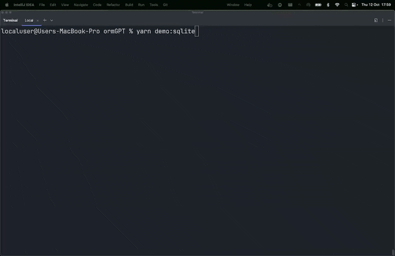

# ormGPT

An ORM based on OpenAI that translates plain human language into SQL queries and executes them on a database.

Currently supports database dialects: MySQL, PostgreSQL, and SQLite.

Supported languages: English, German, French, Spanish, Polish, Italian, Dutch, Portuguese, Ukrainian, Arabic, Chinese, Japanese, Korean, Turkish and many more.

```shell
ormgpt.query("give me post with id 1, all comments for this post and user information about author");
```

Generated query:
```sql
SELECT 
  p.id AS post_id, 
  p.title, 
  p.body, 
  c.id AS comment_id, 
  c.body AS comment_body, 
  u.username AS author_username, 
  u.email AS author_email 
FROM 
  posts p 
  JOIN comments c ON p.id = c.post_id 
  JOIN users u ON u.id = p.user_id 
WHERE 
  p.id = 1;
```

Response:
```js
[
  {
    post_id: 1,
    title: 'Hello world!',
    body: 'This is my first post!',
    comment_id: 1,
    comment_body: 'Hello world!',
    author_username: 'test',
    author_email: 'test@example.com'
  }
]
```



## Installation

```shell
npm install ormgpt

# or

yarn add ormgpt

# or

pnpm add ormgpt
```

## Usage
Prepare a database schema file, for example `schema.sql`. This file will be used to generate queries.

```js
  const client = await createConnection({
    host: 'localhost',
    port: 3306,
    database: 'ormgpt',
    user: 'root',
    password: 'mysecretpassword',
  });

  const mysqlAdapter = new MysqlAdapter({
    client
  });

  const ormgpt = new ormGPT({
    apiKey: "OPENAI_API_KEY",
    schemaFilePath: "./example/schema.sql",
    dialect: "postgres",
    dbEngineAdapter: mysqlAdapter,
  });

  await ormgpt.query(
    "add new user with username 'test' and email 'test@example.com'",
  );
    
  const users = await ormgpt.query("get all users");
  console.log(users);
```

### Adapters

MySQL
```js
const client = await createConnection({
  host: 'localhost',
  port: 3306,
  database: 'ormgpt',
  user: 'root',
  password: 'mysecretpassword',
});

const mysqlAdapter = new MysqlAdapter({
  client
});
```

Postgres
```js
const client = new Client({
  host: 'localhost',
  port: 5432,
  database: 'ormgpt',
  user: 'mysecretuser',
  password: 'mysecretpassword',
});
client.connect();

const postgresAdapter = new PostgresAdapter({
  client
});
```

SQLite
```js
const sqliteAdapter = new SqliteAdapter({
  dbFilePath: "./example/db.sqlite",
});
```

### Why?

In the last two years, I found ORMs to be new "days since the last javascript framework" in the JavaScript ecosystem. And since AI is a hot buzzword
I decided to experiment a little to combine both and create an ORM that uses OpenAI to generate SQL queries. Please don't use this in production.

### License
MIT